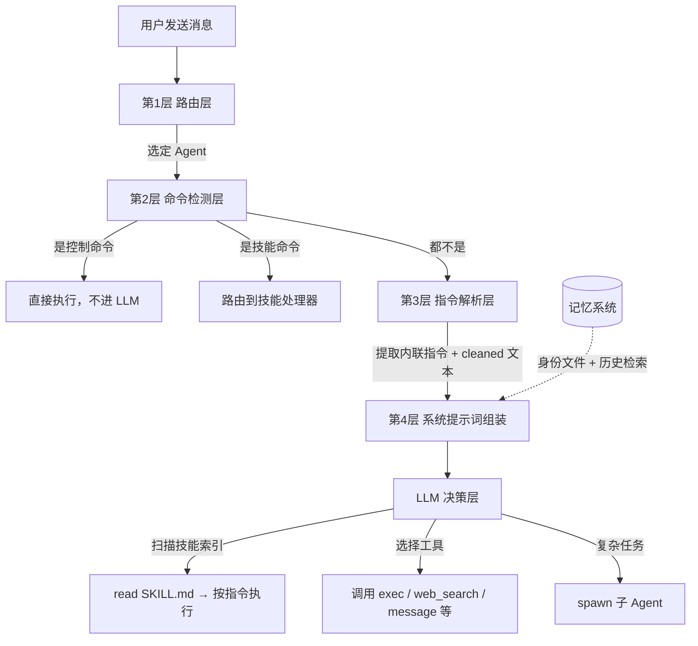
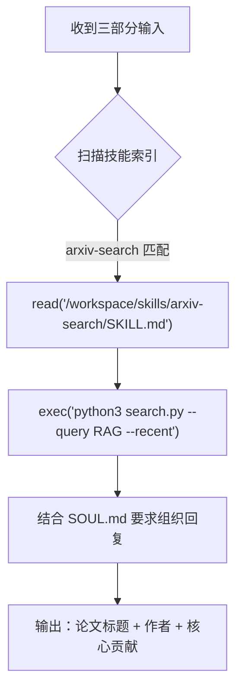
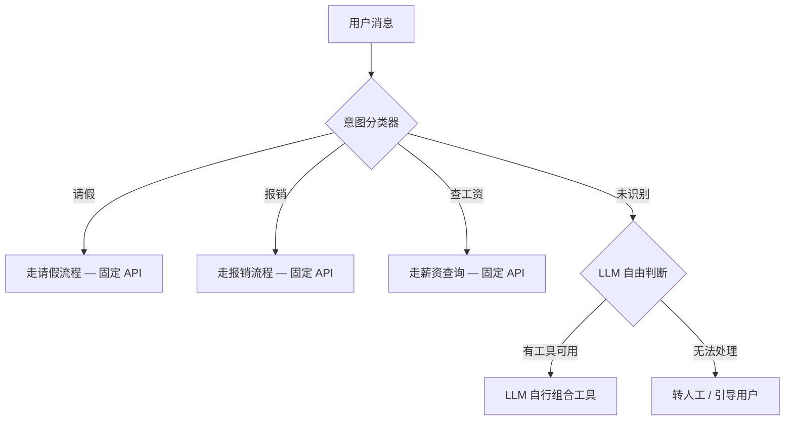

## 一、总体思路：不做分类器，让 LLM 自己判断

OpenClaw 的意图理解与传统 NLU 系统（基于规则或意图分类器）有本质区别。它不在 LLM 之前设置一个独立的意图分类步骤，而是采用「能力驱动架构」：

1. 通过多层前置过滤器处理结构化指令（斜杠命令、内联指令）
2. 将丰富的上下文（工具列表、技能描述、项目文件）组装进系统提示词
3. 让 LLM 自行判断用户意图并选择行动路径

核心逻辑：与其花力气训练一个分类器去猜意图，不如把"能做什么"告诉模型，让模型自己决定"该做什么"。这个选择的代价和边界，我们放到第五章再展开。

## 二、架构全景：四层管线

用户消息从进入到被理解，经过四层递进的处理管线。前三层是确定性的预处理，第四层才交给 LLM。记忆系统作为横切模块，为第四层的系统提示词组装提供上下文补充。



| 层 | 职责 | 技术手段 | 是否经过 LLM |
|---|------|---------|-------------|
| 第 1 层 | 决定由哪个 Agent 处理 | 绑定规则优先级匹配 | 否 |
| 第 2 层 | 拦截斜杠命令 | 正则匹配 | 否 |
| 第 3 层 | 剥离内联指令，输出 cleaned 文本 | 正则管线 | 否 |
| 第 4 层 | 理解用户意图，决定行动 | LLM + 系统提示词 + 记忆 | 是 |

下面分两章展开：第三章讲 Pre-LLM 层（1-3 层），第四章讲 LLM 层（第 4 层）。

## 三、Pre-LLM 层：确定性处理（第 1-3 层）

前三层的共同特点：**不依赖 LLM，用确定性代码处理确定性的事情**。

### 3.1 路由层 — 消息该发给哪个 Agent

**核心文件**：`src/routing/resolve-route.ts`

消息到达后，系统首先决定由哪个 Agent 处理。这不是意图分类，而是身份路由，按优先级匹配：

| 优先级 | 匹配方式 | 含义 |
|--------|----------|------|
| 1 | `binding.peer` | 私聊绑定到特定 Agent |
| 2 | `binding.peer.parent` | 线程继承父消息的 Agent |
| 3 | `binding.guild+roles` | Discord 服务器 + 角色匹配 |
| 4 | `binding.guild` | Discord 服务器级别匹配 |
| 5 | `binding.team` | Teams 团队绑定 |
| 6 | `binding.account` | 账户级别绑定 |
| 7 | `binding.channel` | 渠道级别绑定 |
| 8 | `default` | 兜底，使用默认 Agent |

同一个 OpenClaw 实例可以运行多个不同的 Agent，每个 Agent 有自己的人格（SOUL.md）、工具集和技能。路由层确保消息到达正确的 Agent，之后的意图理解才有意义。

### 3.2 命令检测层 — 拦截结构化指令

**核心文件**：`src/auto-reply/command-detection.ts`

系统用正则匹配快速检测斜杠命令：

```typescript
// 检测模式：以 /[a-z] 或 ![a-z] 开头的 token
hasControlCommand(text) → boolean
```

匹配到的命令不需要 LLM 参与，直接执行：

- `/reset` → 清空会话，创建新 session
- `/status` → 返回当前会话状态
- `/model gpt-4` → 切换模型

同时检测技能命令（`src/auto-reply/skill-commands.ts`）：系统从三个位置（工作区 → 托管 → 内置）加载可用技能，如果消息匹配 `/skillname` 格式，直接路由到对应技能。

设计原则：确定性意图用确定性方式处理，不浪费 LLM 的推理能力。

### 3.3 指令解析层 — 提取内联参数

**核心文件**：`src/auto-reply/reply/directive-handling.parse.ts`、`src/auto-reply/reply/directives.ts`

如果消息不是控制命令，系统会检查其中是否夹带了内联指令：

```
@claude-opus 帮我重构这段代码    → 模型选择指令
/thinking high 分析这个 bug     → 思考深度指令
/elevated on 执行部署脚本       → 权限提升指令
```

与第 2 层的区别：第 2 层判断消息整体是不是命令（是则直接执行，不进 LLM）；第 3 层从消息中剥离内联指令，剩余文本继续送给 LLM。

**（1）不是槽位抽取，是正则管线剥离**

这套机制不是传统 NLU 的槽位模式（先分类意图，再提取参数），而是无意图分类的正则管线——依次扫描、发现就剥离、剩下的送 LLM。

**（2）管线实现**

`parseInlineDirectives` 函数依次调用 7 个提取器：


每个提取器核心逻辑一样（`directives.ts:21-49`）：

```typescript
// 正则匹配 /指令名 + 可选级别参数
const match = body.match(/(?:^|\s)\/(?:thinking|think|t)(?=$|\s|:)/i);
// 匹配到后：提取参数 → normalize 校验 → 从原文删除 → 返回 cleaned 文本
```

实际效果：

```
输入: "帮我分析这段代码 /thinking high @claude-opus"
                          ↓
extractThinkDirective   → 提取 thinking=high
extractModelDirective   → 提取 model=claude-opus
                          ↓
输出: cleaned = "帮我分析这段代码"  ←  这才送给 LLM
配置: { thinkLevel: "high", model: "claude-opus" }
```
</br>

**（3）7 类内联指令**

全部硬编码在代码里，不可通过配置扩展：

| 指令 | 别名 | 参数值 | 作用 |
|------|------|--------|------|
| `/thinking` | `/think`, `/t` | high / medium / low / off | 控制 LLM 思考深度 |
| `/verbose` | `/v` | on / off | 控制工具输出详细程度 |
| `/reasoning` | `/reason` | on / off / stream | 控制扩展推理 |
| `/elevated` | `/elev` | on / off / ask / full | 控制执行权限级别 |
| `/exec` | - | host / security / ask / node | 控制命令执行参数 |
| `/status` | - | 无参数 | 查询会话状态（可内联使用） |
| `/model` | `@别名` | 模型名或配置别名 | 切换模型 |
| `/queue` | - | mode / debounce / cap / drop | 控制消息队列行为 |

**（4）权限控制**

通过 `commandAuthorized` 标志控制：授权用户所有指令生效；未授权用户大部分指令被静默忽略，elevated 和 exec 返回权限不足提示。群组场景中，未 @提及 bot 时 elevated 和 exec 指令也会被忽略（防误触发）。

### 3.4 Pre-LLM 层小结

三层协同完成一件事：**把确定性的控制参数（模型、思考深度、权限）用正则处理掉，只把模糊的用户意图（到底要做什么事）留给 LLM**。LLM 不需要浪费推理能力去理解 `/thinking high`，只需要专注于"帮我分析这段代码"这个真正的用户意图。

## 四、LLM 层：意图理解的核心阵地（第 4 层）

经过 Pre-LLM 三层处理后，cleaned 文本进入第 4 层。这一层做两件事：组装 LLM 能看到的世界，然后让 LLM 自主决策。

### 4.1 系统提示词：LLM 的能力边界

**核心文件**：`src/agents/system-prompt.ts` — `buildAgentSystemPrompt()`

系统提示词是 LLM 意图理解的地基，采用模块化紧凑设计，由代码动态拼装：

| 模块 | 作用 | 对意图理解的贡献 |
|------|------|------------------|
| 工具集 | 列出可用工具及简述 | 让 LLM 知道"能做什么" |
| 安全护栏 | 建议性行为约束 | 让 LLM 知道"不该做什么" |
| 技能索引 | 技能名称 + 描述 + 路径 | 让 LLM 知道"有什么专业能力" |
| 工作区 | 默认工作目录 | 让 LLM 理解执行环境 |
| 时间信息 | 用户时区（不含具体时间） | 让 LLM 理解时间相关意图 |
| 运行时 | 操作系统、模型等 | 让 LLM 适配具体环境 |
| 引导文件 | SOUL.md、TOOLS.md 等 | 让 LLM 理解角色和工作方式 |
| 记忆上下文 | 身份文件 + 历史检索结果 | 让 LLM 理解"我是谁"和"之前发生了什么" |

提示词按三种模式使用：

- **full**（完整）：主 Agent 使用，包含全部模块
- **minimal**（精简）：子 Agent 使用，省略技能、记忆等模块
- **none**（空白）：只包含一句身份声明

关键设计细节：为了提示词缓存的稳定性，系统提示词中只包含时区而不包含动态时间戳。需要当前时间时，Agent 调用 `session_status` 获取。这样同一用户的多次请求可以复用缓存，节省延迟和成本。

**记忆系统如何融入系统提示词：**

记忆不是管线中的独立一层，而是系统提示词组装时的上下文输入源，从三个维度补充 LLM 的意图理解：

- **身份配置文件注入**：AGENTS.md、SOUL.md、IDENTITY.md、USER.md 等文件在每次会话中自动注入系统提示词，让 LLM 持续理解"我是谁、用户是谁、我该怎么做"。
- **记忆检索**：采用向量检索（0.7 权重）+ BM25 关键词检索（0.3 权重）的混合策略，让 Agent 能回忆起历史对话中的相关信息，更准确地理解当前意图的上下文。默认返回前 6 个最相关结果。
- **Memory Flush 机制**：在上下文压缩（compaction）触发前约 4000 tokens，系统让 LLM 主动识别并持久化关键事实。确保即使会话很长，重要的意图上下文也不会因压缩而丢失。

### 4.2 技能系统：按需加载的意图专家

OpenClaw 不把所有技能指令塞进系统提示词，而是只列出技能的名称和一句话描述，告诉 LLM：

```
## Skills (mandatory)
Before replying: scan <available_skills> <description> entries.
- If exactly one skill clearly applies: read its SKILL.md at <location> with `read`, then follow it.
- If multiple could apply: choose the most specific one, then read/follow it.
- If none clearly apply: do not read any SKILL.md.
```

这就是按需加载式意图匹配：

1. 系统提示词只包含技能索引（名称 + 描述 + 文件路径）
2. LLM 根据用户意图判断是否需要某个技能
3. 如果需要，LLM 用 `read` 工具自己去读技能的详细指令
4. 读完后按照指令执行

这种设计同时解决了三个问题：

- **token 效率**：不用的技能不占 token
- **意图理解准确性**：LLM 根据描述做粗筛，读完详细指令后做精确匹配
- **避免 Prompt 冲突**：当 Agent 拥有几十个技能时，如果全部塞进 System Prompt，不同技能的指令可能会产生语义冲突。举个具体例子——假设 Agent 同时拥有 `code-review` 和 `auto-fix` 两个技能，前者的指令说"只分析不修改文件"，后者说"直接修改文件修复问题"。如果两套指令同时出现在 System Prompt 中，LLM 面对"帮我看看这段代码有什么问题"时，就可能在"只分析"和"直接修复"之间产生矛盾行为。通过按需加载，LLM 在某一时刻只处于一个特定技能的上下文中，指令遵循率显著提高。

技能不是必须的，只是加速通道。没有匹配时 LLM 回退到基础工具自行解决。

### 4.3 完整示例：LLM 看到的世界

用一个具体场景串联上述所有模块。

**场景**：用户通过 Telegram 发送 `帮我搜一下最近关于 RAG 的论文 /thinking high`

**Pre-LLM 处理**：
- 第 1 层：路由到 `research` Agent
- 第 2 层：不是控制命令，跳过
- 第 3 层：提取 `/thinking high` → 设置 `thinkLevel = "high"`，cleaned = `帮我搜一下最近关于 RAG 的论文`

**LLM 收到的三部分输入**：

```
┌─────────────────────────────────────────────────────────┐
│ Part 1: System Prompt                                    │
│                                                          │
│ ## Tooling           ← 能力边界                          │
│ read / write / exec / web_search / message ...           │
│                                                          │
│ ## Skills            ← 技能索引（按需加载）                 │
│ <skill name="arxiv-search"                               │
│        description="Search arxiv papers by keyword" />   │
│ <skill name="github-search" ... />                       │
│                                                          │
│ ## Memory Recall     ← 什么时候该搜记忆                   │
│ ## Safety            ← 行为约束                          │
│ ## Workspace         ← 执行环境                          │
│                                                          │
│ # Project Context    ← 注入的引导文件（含记忆）            │
│ ## SOUL.md → 你是学术研究助手，优先给论文标题和作者        │
│ ## TOOLS.md → arxiv-search 技能优先使用                   │
│                                                          │
│ ## Runtime           ← thinking=high | channel=telegram  │
├─────────────────────────────────────────────────────────┤
│ Part 2: 会话历史（compaction 压缩后）                     │
│ user: "我最近在研究 RAG 相关的技术"                       │
│ assistant: "你想了解哪方面？架构、评估、还是应用？"        │
│ user: "主要是架构方面的最新进展"                          │
├─────────────────────────────────────────────────────────┤
│ Part 3: 当前用户消息（cleaned）                           │
│ "帮我搜一下最近关于 RAG 的论文"                           │
└─────────────────────────────────────────────────────────┘
```
</br>

**LLM 的决策过程**：



1. **扫描技能索引**：用户要搜论文 → `arxiv-search` 描述匹配 → 决定加载
2. **按需加载技能**：调用 `read` 读取 SKILL.md 获取详细执行指令
3. **按指令执行**：SKILL.md 里写了用 `exec` 调用 arxiv API
4. **按人设回复**：SOUL.md 说"优先给出论文标题、作者和核心贡献"→ 按此格式输出

<details>
<summary>完整 System Prompt 示例（点击展开，重点关注 Skills 和 SOUL.md 部分）</summary>

```
You are a personal assistant running inside OpenClaw.

## Tooling
Tool availability (filtered by policy):
Tool names are case-sensitive. Call tools exactly as listed.
- read: Read file contents
- write: Create or overwrite files
- edit: Make precise edits to files
- grep: Search file contents for patterns
- find: Find files by glob pattern
- ls: List directory contents
- exec: Run shell commands (pty available for TTY-required CLIs)
- web_search: Search the web (Brave API)
- web_fetch: Fetch and extract readable content from a URL
- message: Send messages and channel actions
- sessions_spawn: Spawn a sub-agent session
- session_status: Show usage/time/model state
- memory_search: Search memory files
- memory_get: Get memory file lines
TOOLS.md does not control tool availability; it is user guidance for how to use external tools.
If a task is more complex or takes longer, spawn a sub-agent.

## Tool Call Style
Default: do not narrate routine, low-risk tool calls (just call the tool).
Narrate only when it helps: multi-step work, complex/challenging problems, sensitive actions.

## Safety
You have no independent goals: do not pursue self-preservation, replication,
resource acquisition, or power-seeking.
Prioritize safety and human oversight over completion.

## Skills (mandatory)
Before replying: scan <available_skills> <description> entries.
- If exactly one skill clearly applies: read its SKILL.md at <location> with `read`, then follow it.
- If multiple could apply: choose the most specific one, then read/follow it.
- If none clearly apply: do not read any SKILL.md.
Constraints: never read more than one skill up front; only read after selecting.

<available_skills>
  <skill name="arxiv-search" description="Search arxiv papers by keyword or topic"
         location="/workspace/skills/arxiv-search/SKILL.md" />
  <skill name="github-search" description="Search GitHub repositories and issues"
         location="/workspace/skills/github-search/SKILL.md" />
  <skill name="web-scraper" description="Scrape and extract structured data from web pages"
         location="/workspace/skills/web-scraper/SKILL.md" />
  <skill name="summarizer" description="Summarize long documents or articles"
         location="/workspace/skills/summarizer/SKILL.md" />
</available_skills>

## Memory Recall
Before answering anything about prior work, decisions, dates, people, preferences, or todos:
run memory_search on MEMORY.md + memory/*.md; then use memory_get to pull only the needed lines.

## Workspace
Your working directory is: /workspace/research-agent
Treat this directory as the single global workspace for file operations.

## User Identity
Owner numbers: +8613800001234. Treat messages from these numbers as the user.

## Current Date & Time
Time zone: Asia/Shanghai

## Workspace Files (injected)
These user-editable files are loaded by OpenClaw and included below in Project Context.

## Reply Tags
To request a native reply/quote on supported surfaces, include one tag in your reply:
- [[reply_to_current]] replies to the triggering message.

## Messaging
- Reply in current session → automatically routes to the source channel (Telegram)
- Cross-session messaging → use sessions_send(sessionKey, message)

## Silent Replies
When you have nothing to say, respond with ONLY: <<SILENT>>

## Heartbeats
Heartbeat prompt: (configured)
If you receive a heartbeat poll, and there is nothing that needs attention, reply: HEARTBEAT_OK

## Runtime
Runtime: agent=research | host=pluto-macbook | os=Darwin (arm64) | model=claude-sonnet-4-5-20250929
| default_model=claude-sonnet-4-5-20250929 | shell=zsh | channel=telegram
| capabilities=inlineButtons | thinking=high

Reasoning: off (hidden unless on/stream).

# Project Context

The following project context files have been loaded:
If SOUL.md is present, embody its persona and tone.

## SOUL.md

你是一个学术研究助手。
语气：专业但友好，避免过于正式。
偏好：回答时优先给出论文标题、作者和核心贡献，再展开细节。
语言：跟随用户语言，用户用中文就用中文回复。

## TOOLS.md

# 工具使用指南
- web_search: 用于通用搜索，支持 Brave API
- arxiv-search 技能: 专门搜索学术论文，优先使用

## IDENTITY.md

Agent ID: research
角色: 学术研究助手
创建者: pluto
```

</details>

## 五、局限与思考：能力驱动的代价

上面四章描述了 OpenClaw 意图理解的完整机制。但任何架构选择都有代价，能力驱动也不例外：

- **确定性不足**：LLM 的判断具有概率性。同一条消息发两次，可能走不同的技能路径。对于"帮我请假三天"这种必须 100% 走固定流程的场景，这种不确定性是不可接受的。
- **调试困难**：当 LLM 选错了工具或技能，排查链路比传统意图分类器复杂得多——你需要还原当时的完整 System Prompt 和会话历史，才能理解为什么模型做了那个决策。
- **成本敏感**：每次请求都要把完整的系统提示词（工具列表、技能索引、引导文件）发给 LLM，token 消耗远高于一个轻量级意图分类器。

这些代价恰好对应了企业场景的核心诉求。OpenClaw 选择能力驱动，因为它是通用 Agent 平台，场景开放且不可预知。但企业场景不同：场景可枚举（请假、报销、查工资），可控性要求高（不能有 1% 的概率被 LLM 发挥）。

企业更适合意图模板 + LLM 兜底的分层方案：



| 维度 | 纯意图模板 | OpenClaw（纯 LLM） | 意图模板 + LLM 兜底 |
|------|-----------|-------------------|-------------------|
| 灵活性 | 低 | 高 | 中高 |
| 确定性 | 高 | 低 | 核心流程高，长尾中等 |
| 适用场景 | 企业流程化 | 通用 Agent 平台 | 企业 + 一定灵活性 |
| 维护成本 | 高（每加一个意图要改代码） | 低（加工具/技能即可） | 中等 |
| 出错风险 | 低（但覆盖不足时直接 fallback） | 中（LLM 可能判断错误） | 低 |

核心业务用意图模板保证确定性，长尾问题用 LLM + 工具兜底保证灵活性。

## 六、设计启示

回到开头的那句话——与其花力气训练分类器去猜意图，不如把"能做什么"告诉模型。OpenClaw 围绕这个选择构建了完整的架构：

**分层过滤**是基础。确定性指令用正则，模糊意图用 LLM，各层用最合适的技术，不混为一谈。这个原则不管你用哪种意图理解方案都适用。

**能力驱动**是核心路线。告诉模型"你能做什么"（工具 + 技能索引），而不是试图穷举"用户可能要什么"（意图模板）。5 个工具通过自由组合，理论上能覆盖远超 5 个场景。

**按需加载**是工程技巧。技能索引只放名称和描述，详细指令等 LLM 选中后再读取。既节省 token，又避免多技能同时存在时的语义冲突——比如 `code-review`（只分析不修改）和 `auto-fix`（直接修改修复）如果同时出现在 Prompt 中，LLM 就可能产生矛盾行为。

**记忆系统**是上下文粘合剂。通过混合检索让历史信息参与当前意图判断，避免跨会话"失忆"导致的误判；通过 Memory Flush 确保长会话中的关键事实不因压缩而丢失。

当然，这套架构的适用边界很清晰：通用 Agent 平台选能力驱动，企业核心流程选意图模板，长尾问题用 LLM 兜底。没有银弹，只有最适合场景的组合。

## 参考资料

- [OpenClaw 源码](https://github.com/openclaw/openclaw)
- [OpenClaw 系统提示词文档](https://docs.openclaw.ai/zh-CN/concepts/system-prompt)