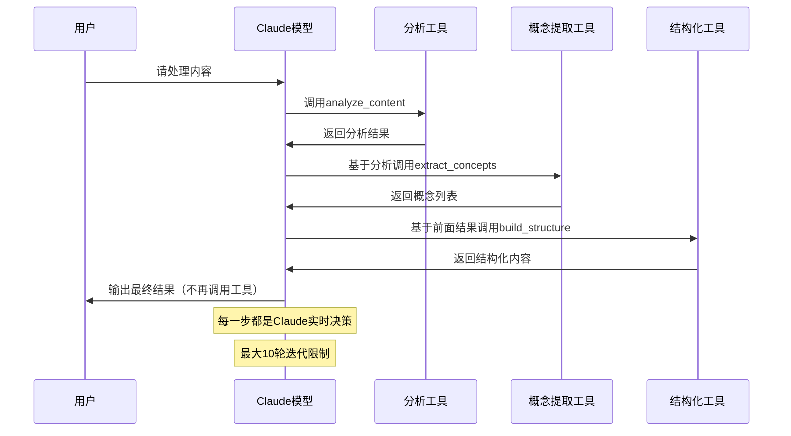
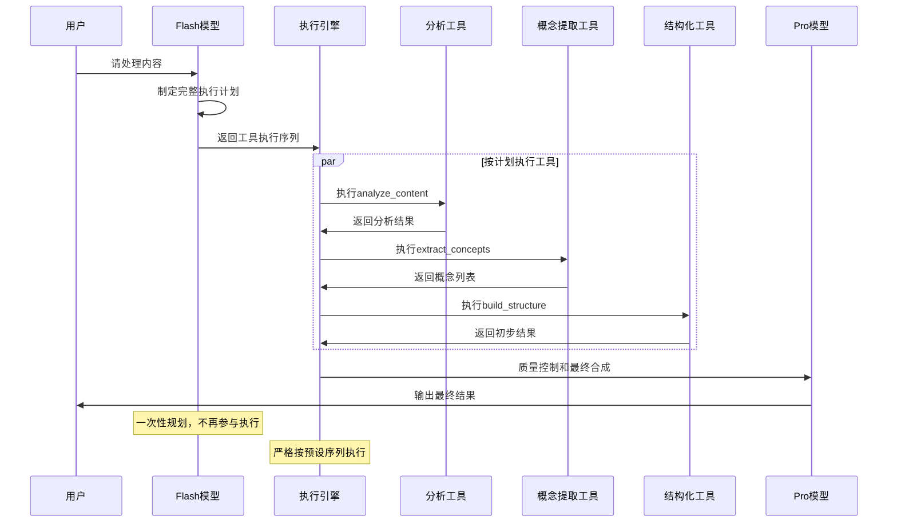

# Agent工具调用机制对比

在学习AI过程中，经常遇到碎片化信息难以整理的问题。为了构建有效的知识管理体系，开发了一个智能知识整理工具，使用AI处理文章和文档，生成结构化笔记。项目同时也是对Agent工具调用机制的技术调研，实现了两个不同的版本。

- **AI规划版本**：[GitHub链接](https://github.com/Plutoxx28/knowledge-agent)
- **自主决策版本**：[GitHub链接](https://github.com/Plutoxx28/knowledge-agent-claudetools)

## 一、两种模式概览

### 核心差异

| 对比维度 | 自主决策型 | AI规划型 |
|---------|------------|----------|
| **核心理念** | AI完全自主选择和调用工具 | AI负责策略规划，程序负责执行 |
| **技术基础** | Function Calling原生工具调用 | AI策略规划 + 程序化工具编排 |
| **决策时机** | 实时动态决策，每轮重新判断 | 一次性制定完整计划 |
| **控制方式** | `tool_choice="auto"` | 预设执行序列 |
| **成本控制** | 不可预测，依赖模型决策 | 分层模型使用(Flash+Pro)，成本可控 |
| **错误处理** | 错误信息传递给AI决策 | 多层降级机制 + Fallback保障 |
| **适用场景** | 原型验证、灵活需求 | 生产环境、稳定需求 |

### 架构对比

#### 自主决策型执行时序图


#### AI规划型执行时序图  



## 二、技术实现详解

### 2.1 自主决策型实现

#### 工具注册机制

通过装饰器模式自动生成OpenAI Function Calling格式的schema：

```python
@tool_registry.register_tool
async def extract_concepts(
    content: str, 
    method: str = "ai_enhanced", 
    max_concepts: int = 10
) -> List[Dict[str, Any]]:
    """从内容中提取核心概念和重要术语"""
    # 实现逻辑
```

ToolRegistry自动解析函数签名，生成标准schema供Claude调用。

#### 调用流程与对话历史管理

```python
# 核心迭代循环
max_iterations = 10
current_messages = messages.copy()

while iteration < max_iterations:
    # 1. Claude决策
    response = ai_client.chat.completions.create(
        messages=current_messages,  # 包含完整历史
        tools=available_tools,
        tool_choice="auto"
    )
    
    # 2. 执行工具调用
    if message.tool_calls:
        for tool_call in message.tool_calls:
            result = await tool_registry.call_tool(
                tool_call.function.name,
                **json.loads(tool_call.function.arguments)
            )
            # 添加工具结果到对话历史
            current_messages.append({
                "role": "tool",
                "tool_call_id": tool_call.id,
                "content": json.dumps(result)
            })
    else:
        break  # Claude认为任务完成
```

**关键点**：
- 通过完整对话历史让Claude了解已执行内容，避免重复调用
- 迭代限制(max_iterations=10)防止无限循环
- Claude自主决定何时停止（不再返回tool_calls）

#### 错误处理

```python
try:
    tool_result = await tool_registry.call_tool(tool_name, **tool_args)
except Exception as e:
    # 错误信息返回给Claude，让其决策下一步
    tool_results.append({
        "tool_call_id": tool_call.id,
        "role": "tool",
        "content": f"工具调用失败: {str(e)}"
    })
```

### 2.2 AI规划型实现

#### 策略规划机制

```python
async def _ai_create_processing_plan(self, content: str, content_type: str):
    """AI分析内容并制定执行计划"""
    response = await ai_client.chat.completions.create(
        model=self.flash_model,  # 使用便宜的Flash模型
        messages=[{
            "role": "system",
            "content": "你是内容处理策略专家，请返回JSON格式处理方案"
        }]
    )
    
    # 返回结构化执行计划
    return {
        "execution_phases": [
            {"phase": "analysis", "tools": ["basic_content_analyzer"]},
            {"phase": "extraction", "tools": ["concept_extractor"]},
            {"phase": "synthesis", "tools": ["markdown_structurer"]}
        ]
    }
```

#### 执行引擎

```python
async def _execute_processing_plan(self, plan: Dict, content: str):
    results = {"content": content}
    
    for phase_config in plan["execution_phases"]:
        # 按阶段执行工具
        if phase_config.get("execution_type") == "parallel":
            phase_results = await self._execute_tools_parallel(
                phase_config["tools"], results
            )
        else:
            phase_results = await self._execute_tools_sequential(
                phase_config["tools"], results
            )
        
        results.update(phase_results)
    
    return results
```

#### 多层降级策略

```python
async def process_content_smart(content: str):
    try:
        # 优先：Claude工具调用
        return await process_with_claude_tools(content)
    except Exception as e:
        logger.warning(f"Claude失败: {e}")
        try:
            # 降级：AI编排
            return await process_with_ai_orchestration(content)
        except Exception as e2:
            logger.warning(f"AI编排失败: {e2}")
            # 最终：Fallback方法
            return _create_fallback_structure(content)
```

## 三、关键技术对比

### 决策机制对比

| 层面 | 自主决策型 | AI规划型 |
|------|------------|----------|
| **决策依据** | 当前上下文 + System Prompt指导 | 内容特征分析 + 规则映射 |
| **工具选择** | Claude实时判断 | 预设映射表 + AI策略 |
| **执行控制** | Claude控制迭代 | 程序控制流程 |
| **防重复机制** | 依赖模型理解上下文 | 预设序列天然去重 |

### 成本与性能分析

**自主决策型**：
- 单一高级模型处理全流程
- API调用次数不可预测（1-10次）
- 每次迭代都需要传递完整历史

**AI规划型**：
- 分层使用模型：Flash(分析/提取) + Pro(合成)
- 固定的API调用次数
- 可并行执行提升性能

### 适用场景分析

**自主决策型适用于**：
- 原型开发和快速验证
- 内容类型多变的场景
- 需要高度灵活性的任务
- 团队有AI调试经验

**AI规划型适用于**：
- 生产环境部署
- 需要成本控制
- 处理流程相对固定
- 需要审计和优化

## 四、实战指南

### 选型建议

1. **评估内容特征**
   - 变化频繁 → 自主决策型
   - 相对固定 → AI规划型

2. **考虑成本预算**
   - 预算充足 → 自主决策型
   - 需要控制 → AI规划型

3. **团队能力评估**
   - AI经验丰富 → 自主决策型
   - 偏好可控性 → AI规划型

### 最佳实践

**通用建议**：
1. **工具设计**：确保函数有完善的docstring和类型注解
2. **日志记录**：详细记录每次工具调用，便于调试
3. **监控指标**：关注API调用频率、成功率、响应时间
4. **错误处理**：实现完备的异常捕获和恢复机制

**自主决策型优化**：
- 优化System Prompt减少不必要的工具调用
- 设置合理的迭代上限
- 实现调用结果缓存

**AI规划型优化**：
- 建立策略历史数据库用于学习优化
- 实现智能的模型选择（Flash vs Pro）
- 完善Fallback机制确保稳定性

## 五、总结

两种Agent工具调用机制代表了不同的技术理念：

**自主决策型**通过`tool_choice="auto"`让AI完全掌控工具调用过程，优势在于灵活性和智能性，适合探索性任务和原型开发。

**AI规划型**将决策与执行分离，AI负责制定策略，程序负责执行控制，优势在于可控性和稳定性，适合生产环境部署。

选择哪种方案取决于具体的应用场景、团队能力和项目需求。理解两种机制的技术细节，才能在实际项目中做出正确的技术选型。

---

**项目链接**：
- AI规划版本：https://github.com/Plutoxx28/knowledge-agent
- 自主决策版本：https://github.com/Plutoxx28/knowledge-agent-claudetools
